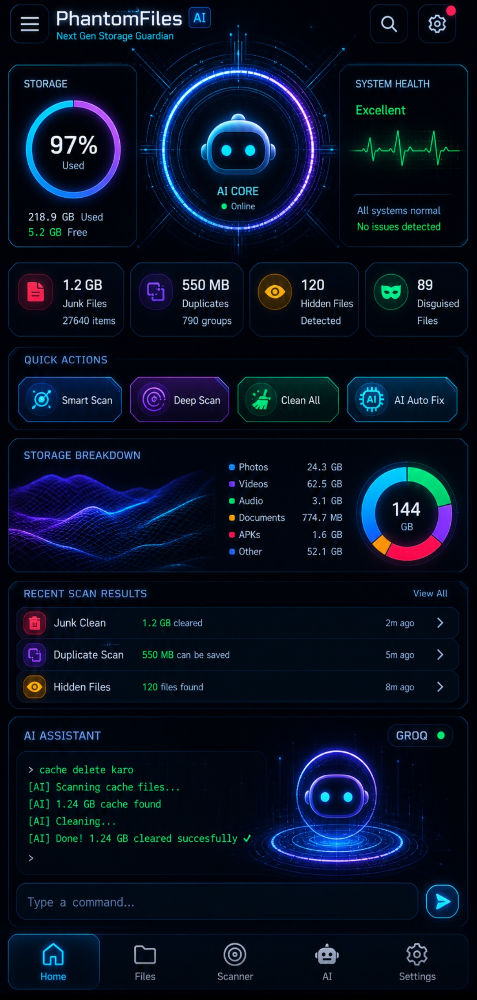
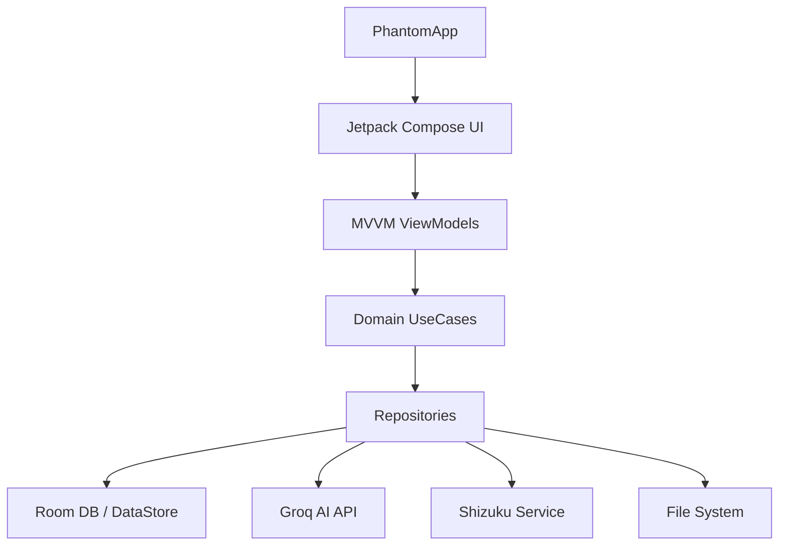

<div align="center">

# 🌌 PhantomFiles Pro
### **Har file. Har raaz. Har jagah.**

[](https://kotlinlang.org)
[](https://developer.android.com)
[](https://shizuku.rikka.app/)
[](LICENSE)

**PhantomFiles Pro** is the world's most advanced Android file manager, blending cutting-edge security with a sleek cyberpunk interface. It features deep Shizuku integration, AI-powered assistance, and unique disguised media detection.



---

</div>

## 🚀 Key Highlights

*   🛡️ **Tri-Mode Access**: Seamlessly switch between **Normal**, **Shizuku**, and **Root** modes for unprecedented file system access.
*   🤖 **AI Assistant**: Control your files with natural language. Just say *"WhatsApp videos dhundho"* or *"1 GB se badi files dikha"*.
*   🕵️ **Disguised Media Finder**: Uncover files hiding behind fake extensions using advanced magic byte analysis.
*   🔒 **Private Vault**: Military-grade **AES-256-CBC** encryption to keep your sensitive data truly private.
*   ♻️ **Smart Recycle Bin**: The first proper recycle bin for Android with auto-restore and configurable cleanup.

---

## 🛠️ Feature Deep Dive

### 📂 Advanced File Management
*   **Full Browser**: Access Internal Storage, SD Cards, and restricted `/Android/data` & `/Android/obb` folders via Shizuku.
*   **Complete Operations**: Copy, move, paste, rename, and batch process 100+ files with ease.
*   **Archive Support**: Create and extract ZIP, RAR, TAR, and GZ archives.

### 🔍 Intelligence & Cleanup
*   **Deep Scanner**: Find duplicates via MD5 hash, locate large files, and clear junk/cache.
*   **Storage Dashboard**: A beautiful, animated breakdown of your storage health and category distribution.
*   **Network Transfer**: Built-in **WiFi FTP Server** for wireless file management from any PC.

### 🛡️ Privacy & Security
*   **Encrypted Vault**: Secure your files with PBKDF2 key derivation and biometric/PIN locks.
*   **Scheduled Ops**: Automate cache cleaning and recycle bin emptying via WorkManager.

---

## 🏗️ Technical Architecture



| Layer | Responsibility |
| :--- | :--- |
| **Presentation** | Jetpack Compose, Material 3, Cyberpunk Theme |
| **Domain** | Business logic, AI Command processing |
| **Data** | Room DB (6 DAOs), Retrofit, Repository Pattern |
| **Utilities** | AES-256, MagicBytes Detection, FTP Server |

---

## ⚡ Tech Stack

| Category | Technology |
| :--- | :--- |
| **Language** | Kotlin 2.0 (The Future of Android) |
| **UI Framework** | Jetpack Compose + Material 3 |
| **Dependency Injection** | Dagger Hilt 2.51.1 |
| **Database** | Room 2.6.1 + DataStore |
| **Networking** | Retrofit + OkHttp |
| **Image Loading** | Coil 2.7.0 |
| **Background Tasks** | WorkManager 2.10.0 |
| **Privileged Access** | Shizuku API 13.1.5 |

---

## 🎨 Cyberpunk Palette

| Color | Hex | Role |
| :--- | :--- | :--- |
| **Deep Black** | `#050505` | Background |
| **Electric Cyan** | `#00E5FF` | Primary Accent |
| **Phantom Purple** | `#7C4DFF` | Secondary / Vault |
| **Neon Green** | `#00E676` | Success / Audio |
| **Danger Red** | `#FF1744` | Errors / Delete |

---

## 📥 Getting Started

### Shizuku Setup
1. Install [Shizuku](https://play.google.com/store/apps/details?id=moe.shizuku.privileged.api) from Play Store.
2. Enable **Wireless Debugging** in Developer Options.
3. Start Shizuku and grant permission to **PhantomFiles Pro**.

### Build from Source
```bash
# Clone the repository
git clone https://github.com/gecew79810-bit/PhantomFilesPro.git

# Build the debug APK
./gradlew assembleDebug
```
*Requires JDK 17, Gradle 8.9, and Android SDK 36.*

---

## 📜 License
**Private** — All rights reserved. Unauthorized copying or distribution is strictly prohibited.

---
<div align="center">
Developed with ❤️ by the PhantomFiles Team
</div>
